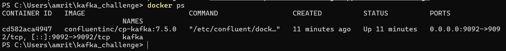
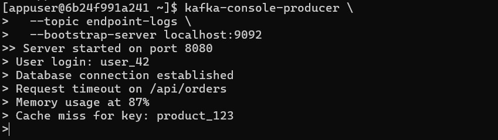
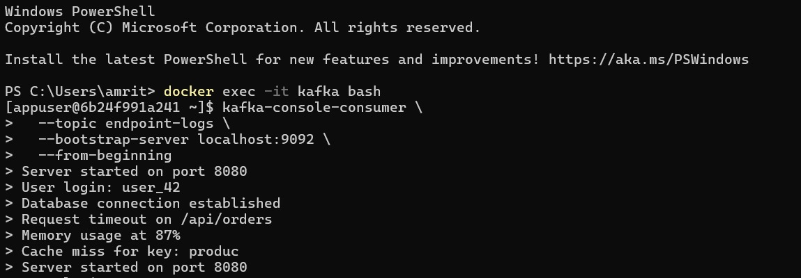
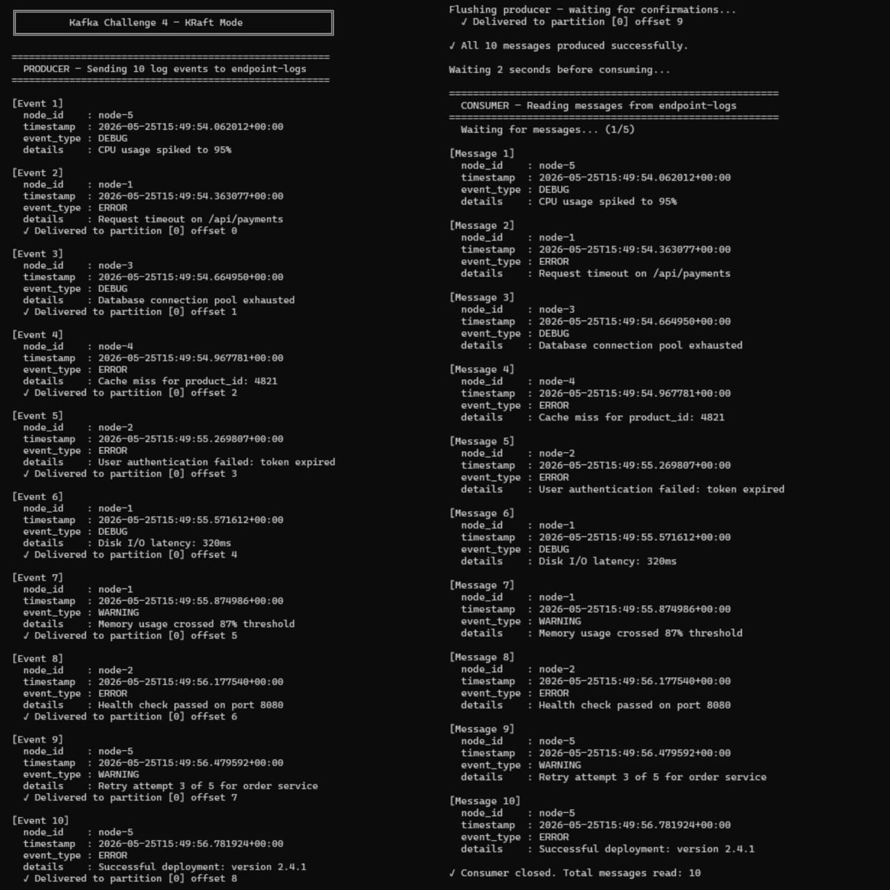

# Kafka Challenge 4 — KRaft Mode

## Overview
Apache Kafka setup using Docker Compose in KRaft mode (no Zookeeper).
Includes CLI-based message production/consumption and a Python producer-consumer script.

## Requirements
- Docker and Docker Compose
- Python 3.x
- confluent-kafka library

## Setup

### 1. Start Kafka
```bash
docker compose up -d
```

### 2. Create Topic
```bash
docker exec -it kafka bash
kafka-topics --create --topic endpoint-logs --bootstrap-server localhost:9092 --partitions 1 --replication-factor 1
```

### 3. Run Python Script
```bash
pip install confluent-kafka
python kafka_producer_consumer.py
```

### 4. Stop Kafka
```bash
docker compose down
```

## Files
- `docker-compose.yml` — Kafka KRaft single broker setup
- `kafka_producer_consumer.py` — Produces and consumes 10 fake log events

## Screenshots

### 1. Docker Containers Running


### 2. Producer — Manual CLI Messages


### 3. Consumer — Reading CLI Messages


### 4. Python Script Output
